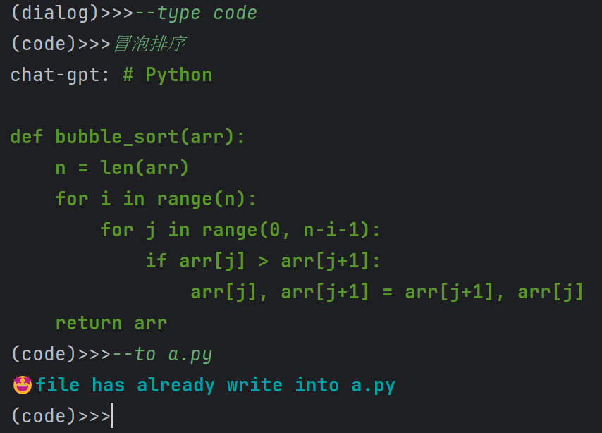

## MyShellGPT
### 结构说明
* chat.py ： 主要是对话的主体调用函数，包括角色选择，角色切换等
* models.py ： 模型的选择(eg: Kimi or ChatGPT)
* utils.py ： 工具类---控制台颜色打印、字符流文件存储
* main.py ： 接受控制台参数并选择对应的命令响应
### 使用说明
0. 使用命令进行依赖环境安装
   ```shell
   pip install -i https://pypi.tuna.tsinghua.edu.cn/simple openai==1.51.2
   ```
1. 在LINUX系统下，项目文件解压到用户目录下
2. 进入到目录shellGPT中，运行
   ```shell
   bash mygpt.sh
   ```
   
3. GPT助手启动，默认为dialog 聊天模式
  
4. 直接在提示符后输入，键入回车进行聊天
   
5. 模型切换
    
    这里内置了两种模型： Kimi 和 ChatGPT3.5
    API_KEY我是写死在程序里的，用的是我自己的API_KEY，都是有每日token上限的，所以大家测试的时候也不要过度测试
    
    其中Kimi由于没有开会员的API，所以有连续响应轮次的限制，如果连续发了三轮消息，第四轮可能要等待一分钟才能响应
    
    切换模型使用命令:
    ```shell
    (dialog)>>> --model [model_name]
   ps: model_name 可选 chat-gpt or kimi
    ```
   当在下一轮次对话中，回复者身份改变，即为切换模型成功

   如：
    
    
6. 角色切换

   内置了三种角色：
   * dialog： 对话模式，可以与GPT进行任意交谈
   * shell： shell模式，输入任务GPT将反馈对应的shell命令
   * code： 通过描述需求，GPT将返回对应的代码，如未制定编程语言则默认python
   
   切换角色使用命令：
   ```shell
     (dialog)>>> --type [role_name]
     role_name可选:
     dialog or shell or code
    ```
   如：
   
7. 关于角色code
   这个角色可以用于生成代码，同时代码可以保存到本地

   注：命令 --to [file_path] 用于将代码保存到file_path中
    
8. 关于角色shell
   这个角色可以生成shell命令，当返回结果后，键入e可以执行shell命令
   
   
9. 添加新角色
   这里允许用户 添加新角色以适配自己的需求，这里以添加新身份“诗词高手”为例：

    使用命令：
   ```shell
    (dialog)>>> --add role
   ```
   添加范例： 

    
10. 终止运行

   在LINUX操作系统下，使用Ctrl+Z终止运行